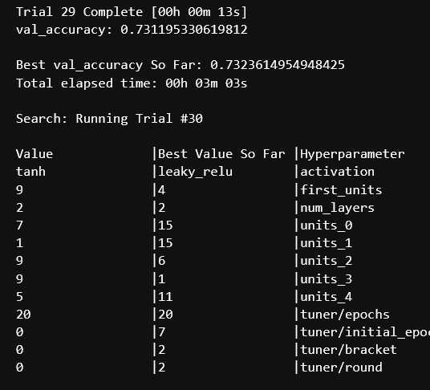

# Module 21 Deep Learning

Keras-Tuner, Neural Networks, and Supervised Learning

## Task at Hand

The nonprofit foundation Alphabet Soup wants a tool that can help it select the applicants for funding with the best chance of success in their ventures. With your knowledge of machine learning and neural networks, you’ll use the features in the provided dataset to create a binary classifier that can predict whether applicants will be successful if funded by Alphabet Soup.

From Alphabet Soup’s business team, you have received a CSV containing more than 34,000 organizations that have received funding from Alphabet Soup over the years. Within this dataset are a number of columns that capture metadata about each organization..

## Overview of the Starter Code

* Consolidate, scale, and dummify the metadata from the dataset
* Compile, train, and evaluate the model
* Followed by a foolhardy (because it's binary) attempt to visualize the query for my squishy human brain

## Overview of Modified

The goal was to adjust the input data and variables within the model to achieve a target predictive accuracy higher than 75%. 

I took the Starter Code clean-up one step further (from dropping EIN/company name from the dataset) and binned "Ask Amount" from its original 8747 unique results to label the same as "Income Amount." I figured, as these are both (and the only) currency fields, they should at least have the same stringed label values. My hope was this would reduce some noise and that the model would recognize this as relational. 

In retrospect, binning is probably still the correct move, but the bin labels should have remained integers to provide appropriate scale during the weight assessment. For those not reading the code:
* Reduce the 8747 unique "ask amounts" to about 9 categories
* Remap the ~9 categories from "Income Amount" to a number, ie. $0 - $50,000,000 (see below Labels)
* Assumption/goal: The weight of this scaled column changes from {'10m - 50m' = Yes} to {10,000,000} (or .2 if 1 = the above $50m max), while the entity’s "Income Amount" would ideally scale to the same .2 if their income is also within the 10m-50m category. 

Labels:
| INCOME_AMT | n_Unique |
|----------|----------|
0  |            24388 |
1-9999  |         728 |
10000-24999  |    543 |
25000-99999  |   3747 |
100000-499999  | 3374 |
1M-5M  |          955 |
5M-10M  |         185 |
10M-50M  |        240 |
50M+  |           139 |

After the data consolidation, cleansing and scaling, I attempted to use Keras_Tuner to find the best parameters for the neural network model. While adding a couple activation functions to the Choice function was a step in the correct direction, embedding the choice within the if statement to pull activation function per layer would have, at least, helped add some clarity, if not achieve the goal. 

I ran (and documented) the tuner 5 times with varying hyperparameters, but equivalent results: 73-74% accuracy. I did notice a Trial in progress that revealed the LeakyReLU activation wanted to soak up all the neurons I allowed in the tuner in the first couple of layers...     

The section after the tuner has 7 documented attempts at reworking the model's accuracy by increasing the neuron capacity and changing the hidden activation functions. While there was *some* strategy - I failed to recognize any particular pattern associated with an improved performance. Ultimately, my *strategy* documentation standards broke down as attempts 8 - ~30 also failed to achieve an overall accuracy above 75%. 

## Summary

This was an interesting, paradoxically complex problem to solve. **I hope my grader has some feedback?** 

To improve the model, as mentioned, I'm considering:

* Converting the currency bin/labels to integers so the metadata is scaled with equivalency "Ask Amount" and "Income Amount"
* Modifying the tuner (once I better understand it/s output) to loop through the activation choice per layer
* Figure out how to appropriately plot the datapoints - for me to visualize what the metadata is doing - to interpret if other columns should be dropped (you'll have seen some attempt at that at the tail end of the Starter Code)
* I did not tweak number of epochs from 100 on the full model fitment - but I'm almost certain that some of my models' overall accuracy would improve with more tail-end, learned and improved epochs over 75%
* Ultimately, conscious of power and performance, I know fewer neurons is the more correct approach

  ...it's conflicting. <3
